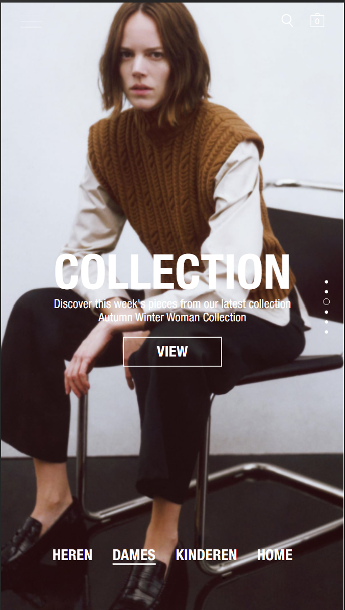
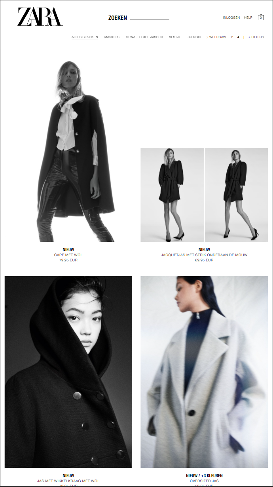

# Procesverslag
**Auteur:** -Yas-lin Li-

Markdown cheat cheet: [Hulp bij het schrijven van Markdown](https://github.com/adam-p/markdown-here/wiki/Markdown-Cheatsheet). Nb. de standaardstructuur en de spartaanse opmaak zijn helemaal prima. Het gaat om de inhoud van je procesverslag. Besteedt de tijd voor pracht en praal aan je website.

## Bronnenlijst
1. -bron 1-
2. -bron 2-
3. -...-

## Eindgesprek (week 7/8)

-dit ging goed & dit was lastig-
het werken met media query's ging goed. wat minder goed ging was het maken van een caurousel. na het geprek heb ik dat maar achtergelaten wat ik erg jammer vond.

**Screenshot(s):**

-screenshot(s) van je eindresultaat-

## Voortgang 3 (week 6)

wat goed ging is het maken van de hamburger button. ook heb ik geoefend met media querys wat makkelijker was dan ik dacht.

## Voortgang 2 (week 5)

Ik heb niet gewerkt aan de website maar geoefend met flexbox.

## Voortgang 1 (week 3)

### Stand van zaken

wat goed ging waas het inzetten van de zontent en het werken aan het structuur.
wat minder ging was het maken van de toggle in javascript. ik snap nog niet zo goes hoe dat werkt.

**Screenshot(s):**

Ik heb helaas geen screenshots genomen.

### Agenda voor meeting

-samen met je groepje opstellen-

| student 1      | student 2          | student 3    | student 4        |
| ---            | ---                | ---          | ---              |
| dit bespreken  | en dit             | en ik dit    | en dan ik dat    |
| an dat ook nog | dit als er tijd is | nog een punt | dit wil ik zeker |
| ...            | ...                | ...          | ...              |

### Verslag van meeting

-na afloop snel uitkomsten vastleggen-

## Breakdownschets (week 1)

-uitwerken voor de 1e werkgroep - eind van de eerste week-

## Intake (week 1)
-uitwerken voor de kick-off werkgroep - begin van de eerste week-

**Je startniveau:** -blauw-

**Je focus:** -surface plane-

**Je opdracht:** -https://www.zara.com/nl/-

**Screenshot(s) van de eerste pagina (small screen):**

**Screenshot(s) van de tweede pagina (small screen):**

